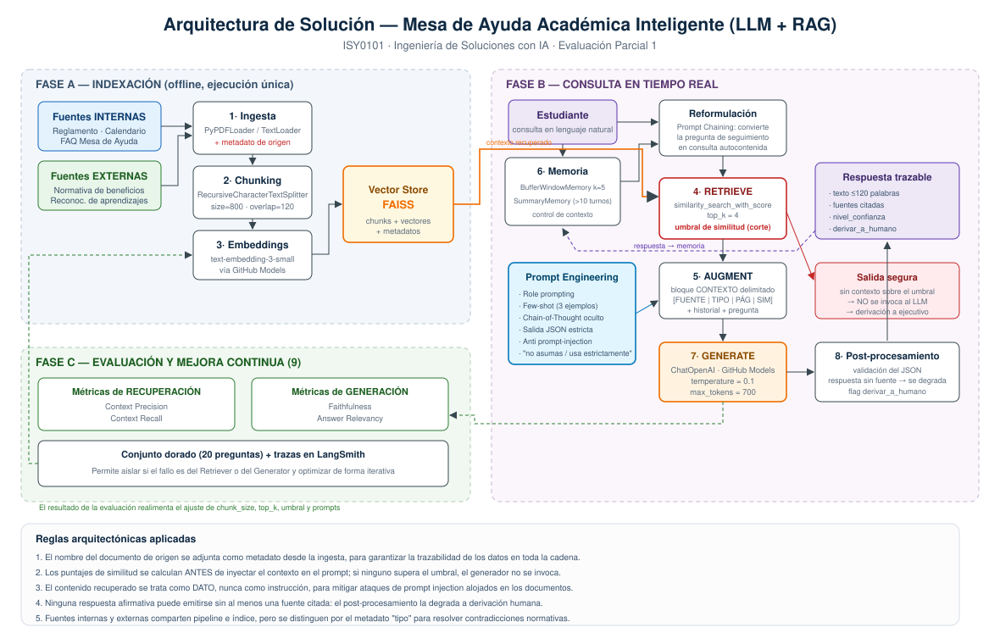

# Mesa de Ayuda Académica Inteligente — Agente LLM + RAG

Sistema de recuperación aumentada (RAG) que responde consultas sobre normativa
académica y beneficios estudiantiles, citando siempre el documento de origen y
derivando a atención humana cuando no tiene respaldo documental.

**Asignatura:** ISY0101 — Ingeniería de Soluciones con IA
**Evaluación:** Parcial 1 (30%) — Diseño de solución con LLM y RAG

---

## 1. Descripción del problema

La Dirección de Asuntos Estudiantiles recibe un volumen alto y estacional de
consultas repetitivas (causales de eliminación, plazos de retiro, convalidaciones,
mantención de beneficios). Las respuestas son inconsistentes entre ejecutivos y un
error puede costarle a un estudiante la pérdida de un beneficio.

Este sistema automatiza la primera línea de atención sobre una base documental
controlada, con trazabilidad verificable y derivación explícita de los casos que
requieren criterio humano.

## 2. Arquitectura



El pipeline sigue el ciclo **Retrieve → Augment → Generate** con tres fases:

| Fase | Módulos | Descripción |
|---|---|---|
| A. Indexación (offline) | Ingesta → Chunking → Embeddings → FAISS | Carga documentos internos y externos, los fragmenta y los indexa vectorialmente |
| B. Consulta (runtime) | Memoria → Reformulación → Retrieve → Augment → Generate → Post-proceso | Resuelve la consulta del estudiante con contexto y trazabilidad |
| C. Evaluación | Métricas + conjunto dorado | Mide calidad de recuperación y de generación por separado |

### Fuentes de información

| Tipo | Documentos |
|---|---|
| **Internas** (`data/interno/`) | Reglamento Académico, Calendario Académico, FAQ de la Mesa de Ayuda |
| **Externas** (`data/externo/`) | Normativa pública de beneficios estudiantiles, Marco de reconocimiento de aprendizajes previos |

Ambas comparten pipeline e índice, pero se diferencian por el metadato `tipo`,
lo que permite detectar contradicciones entre norma interna y externa.

## 3. Estructura del repositorio

```
.
├── config/
│   └── settings.py               # Parámetros centralizados (modelo, RAG, memoria)
├── data/
│   ├── interno/                  # Corpus institucional
│   └── externo/                  # Corpus normativo público
├── docs/
│   ├── arquitectura.svg          # Diagrama de la solución
│   ├── Informe_Tecnico.docx      # Entregable 1
│   └── Guion_Defensa.md          # Entregable 3
├── evaluacion/
│   └── conjunto_dorado.json      # 20 casos de prueba
├── src/
│   ├── ingesta.py                # Módulos 1-2: carga y chunking
│   ├── vector_store.py           # Módulos 3-4: embeddings, FAISS, recuperación
│   ├── prompts.py                # System/user prompts y few-shot
│   ├── memoria.py                # Módulo 6: contexto conversacional
│   ├── rag_pipeline.py           # Módulos 5,7,8: augment, generate, post-proceso
│   ├── evaluacion.py             # Módulo 9: métricas RAG
│   └── main.py                   # Punto de entrada CLI
├── requirements.txt
├── .env.example
└── README.md
```

## 4. Requisitos previos

- Python 3.10 o superior
- Cuenta de GitHub con acceso a **GitHub Models**
- Un *Personal Access Token* de GitHub (permisos de solo lectura bastan)

## 5. Instalación paso a paso

**Paso 1 — Clonar el repositorio**

```bash
git clone https://github.com/<usuario>/mesa-ayuda-rag.git
cd mesa-ayuda-rag
```

**Paso 2 — Crear y activar el entorno virtual**

```bash
python -m venv .venv

# Linux / macOS
source .venv/bin/activate

# Windows (PowerShell)
.venv\Scripts\Activate.ps1
```

**Paso 3 — Instalar dependencias**

```bash
pip install -r requirements.txt
```

**Paso 4 — Configurar las credenciales**

```bash
# Linux / macOS
export GITHUB_TOKEN="tu_token_de_github"
export GITHUB_BASE_URL="https://models.inference.ai.azure.com"
export OPENAI_BASE_URL="https://models.inference.ai.azure.com"

# Windows (PowerShell)
$env:GITHUB_TOKEN="tu_token_de_github"
$env:GITHUB_BASE_URL="https://models.inference.ai.azure.com"
$env:OPENAI_BASE_URL="https://models.inference.ai.azure.com"
```

> El archivo `.env.example` documenta las variables. **Nunca** subas tu token al
> repositorio: `.gitignore` ya excluye `.env`.

## 6. Ejecución

**Paso 5 — Construir el índice vectorial** (obligatorio la primera vez)

```bash
python -m src.main --indexar
```

Genera la carpeta `indice_faiss/` con los embeddings persistidos. Solo debe
repetirse si cambian los documentos de `data/`.

**Paso 6 — Iniciar la atención conversacional**

```bash
python -m src.main --chat
```

Comandos disponibles dentro del chat: `reiniciar` (nueva atención), `salir`.

**Paso 7 — Evaluar el sistema**

```bash
python -m src.main --evaluar
```

Ejecuta las 20 preguntas del conjunto dorado y reporta Context Precision,
Context Recall, Faithfulness y Answer Relevancy.

## 7. Ejemplo de uso

```
Estudiante > Reprobé dos veces Cálculo, ¿qué me pasa?

Asistente > Reprobar por segunda vez consecutiva una misma asignatura
constituye causal de eliminación académica según el Reglamento Académico.
Puedes presentar una apelación fundada ante el Comité Académico dentro de diez
días hábiles desde la notificación.
  Fuentes: Reglamento_Academico (interno)
  Confianza: alto | Se recomienda derivar a un ejecutivo. | Chunks usados: 3

Estudiante > ¿Y eso afecta mi beca?

Asistente > Sí. Perder la calidad de estudiante regular es una causal de pérdida
del beneficio según la normativa pública de beneficios estudiantiles. Debes
contactar a la Dirección de Asuntos Estudiantiles.
  Fuentes: Normativa_Beneficios_Estudiantiles (externo)
  Confianza: alto | Se recomienda derivar a un ejecutivo. | Chunks usados: 2
```

La segunda consulta demuestra la **gestión de contexto conversacional**: la
pregunta "¿y eso afecta mi beca?" es reformulada internamente a una consulta
autocontenida antes de buscar en el índice.

## 8. Parámetros configurables

Todos en `config/settings.py`:

| Parámetro | Valor | Justificación |
|---|---|---|
| `chunk_size` | 800 | Equilibrio entre perder contexto y diluir el significado semántico |
| `chunk_overlap` | 120 | Evita cortar un artículo reglamentario entre dos chunks |
| `top_k` | 4 | Suficiente cobertura sin saturar la ventana de contexto |
| `umbral_distancia` | 1.15 | Corte anti-alucinación: bajo este umbral no se invoca al LLM |
| `temperature` | 0.1 | Respuestas deterministas para información normativa |
| `ventana_turnos` | 5 | Memoria operativa sin inflar el consumo de tokens |

## 9. Stack tecnológico

`openai` · `langchain` · `langchain-openai` · `langchain-community` ·
`faiss-cpu` · `pypdf` — LLM y embeddings servidos por **GitHub Models**.

## 10. Limitaciones conocidas

- El sistema **no resuelve casos particulares**: informa la norma y deriva.
- La calidad depende de la vigencia del corpus; un reglamento desactualizado en
  `data/` produce respuestas correctas respecto al documento pero erróneas
  respecto a la realidad.
- Las métricas de generación se estiman con LLM-as-a-judge, lo que introduce
  varianza; deben leerse como tendencia, no como medición exacta.

## 11. Autores

Proyecto desarrollado en modalidad de trabajo en parejas para la Evaluación
Parcial 1 de ISY0101 — Ingeniería de Soluciones con IA.
